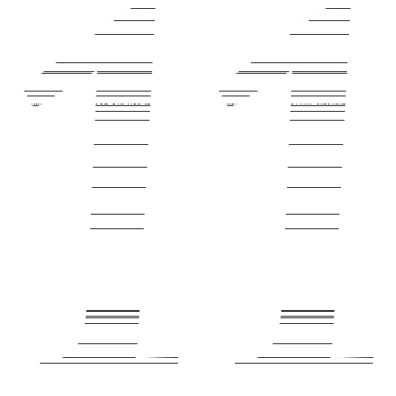

# Create Effects using python Pillow (PIL Fork)

## Examples
### Typing Effect (Check typing_effect.py)

### Noise Effect (Check noise-effect.py)

## Tested On
1. Python 3.8.3
1. Pillow 7.2.0

Hopefully, it should work on other version too.
